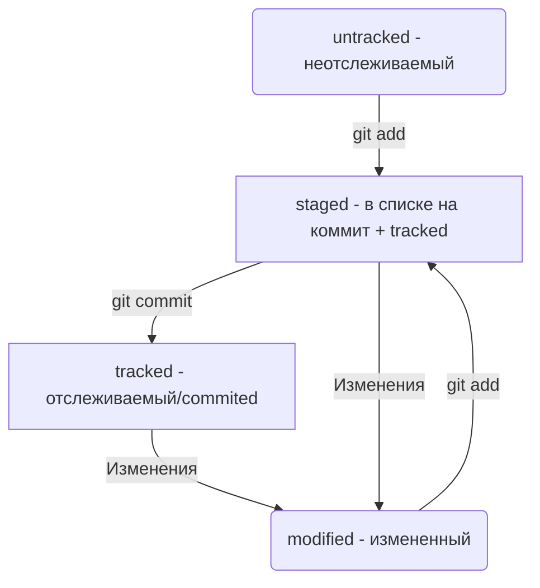

# Это шпаргалка по Git 
## Как инициализировать репозиторий
- Инициализировать репозиторий можно с помощью команды **git init**.
- Проверить статус, или состояние, репозитория поможет команда **git status**.
- Если вы ошиблись и случайно инициализировали не ту папку, можно «разгитить» её — удалить скрытую подпапку **.git**
---
## Как добавить файлы в репозиторий
- Команда **git add** позволяет подготовить файл к сохранению.
- Команда **git add --all** подготовит к сохранению сразу все файлы.
- С помощью **git add .** можно добавить в репозиторий текущую папку со всеми файлами.
---
## Как делать коммиты
- Коммит можно сделать с помощью команды **git commit**.
- Ключ **-m** позволяет присвоить коммиту сообщение. Помните, что такие сообщения должны быть информативными: чётко описывать изменения.
- В коммит попадает то, чтобы было предварительно добавлено «в корзину», или «в кадр», перед коммитом.
---
## Как просматреть историю коммитов
- Используйте **git log**, чтобы оглянуться назад и посмотреть коммиты.
---
## Знакомство с GitHub
- GitHub — платформа, которая работает с Git и упрощает командное взаимодействие.
- Кроме GitHub, существуют и другие подобные платформы, например GitLab, Bitbucket и так далее.
- Git — это консольный инструмент для работы с локальными и удалёнными репозиториями. Он не связан напрямую ни с одной из платформ и развивается отдельно от них.
---
## Что такое SSH-ключ
- SSH — протокол, который обеспечивает безопасный обмен данными в сети и использует для этого ключи.
- SSH-ключ — ваш виртуальный идентификатор в GitHub. Как ключ от квартиры, он позволяет получить доступ к GitHub-репозиторию. Также SSH используется для доступа к другим удалённым серверам.
- SSH-ключ состоит из двух частей — публичной и приватной. Публичный ключ зашифрует данные, а приватный — расшифрует. Приватным ключом ни в коем случае нельзя делиться, иначе любой сможет расшифровать все ваши секреты!
---
## Синхронизация локального и удаленного репозиториев
- Коммиты хранятся в ветках. Начальная ветка создаётся автоматически и называется **main** или **master**.
- За отправку изменений на удалённый репозиторий отвечает команда **git push**.
- Интерфейс GitHub позволяет удобно просмотреть все коммиты в репозитории, а также изменения в этих коммитах.
---
## Хеш - идентификатор коммита
- Git преобразует информацию о коммитах с помощью алгоритма SHA-1 и для каждого из них рассчитывает уникальный идентификатор — хеш.
- Хеш — основной идентификатор коммита и позволяет узнать его автора, дату и содержимое закоммиченных файлов.
- Все хеши, а также таблицу соответствий **хеш → информация о коммите Git** хранит в папке **.git**.
---
## Исследуем лог
- Можно вызвать не только полный лог, но и сокращённый — это делается командой **git log --oneline**.
- В сокращённом логе выводятся сокращённые хеши — их можно использовать точно так же, как и полные.
---
## Файл HEAD
- В числе прочих файлов в папке **.git** есть служебный файл **HEAD**. Он указывает на самый свежий коммит.
- Вместо хеша последнего коммита можно написать слово **HEAD** — Git вас поймёт.
---
## Статусы файлов в Git
- Статусом **untracked** помечается файл, о существовании которого Git знает, но не следит за изменениями в нём. Этот статус — противоположность **tracked**, в который попадают все файлы, отслеживаемые Git.
- Файл переходит в статус **staged** после выполнения **git add**.
- Статус **modified** означает, что файл был изменён.
- Большинство файлов в проектах «шагает» по следующему циклу: «изменён» → «добавлен в список на коммит» → «закоммичен» → «изменён» → и так далее.
### Типичный жизненный цикл файла в Git

---
